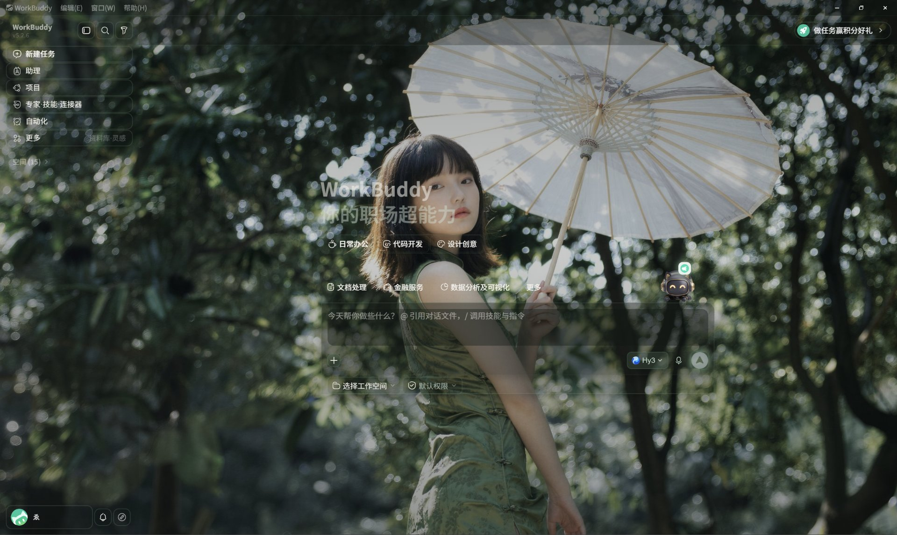

# WorkBuddy 皮肤开发 Skill (workbuddy-skin-dev)

给 [WorkBuddy](https://www.codebuddy.cn) 桌面客户端做皮肤的一套可复用方法 —— 通过
**Chrome DevTools Protocol (CDP)** 把 CSS 注入渲染进程,**不修改安装目录、不碰 `app.asar`**,
重启即失但启动器每次自动重注,WorkBuddy 更新免疫。

本仓库既是一个 **WorkBuddy Skill**(可被 WorkBuddy 加载,获得"做皮肤"的专业知识),
也是一套**可直接拿来用的跨平台脚本**(不依赖 WorkBuddy 也能跑)。

## 特性
- 🎨 **通用注入器** `inject.mjs`:`inject` / `remove` / `inspect` 三模式,与具体皮肤解耦。
- 🚀 **跨平台启动器** `launch.mjs`:自动探测 WorkBuddy 与 Node,拉起带调试端口的实例并注入(Windows / macOS / Linux)。
- 🧱 **一键脚手架** `scaffold.mjs`:从模板生成一个自包含的新皮肤项目。
- 📦 **绿色分享**:生成的皮肤文件夹双击即用,删除即卸载。
- 🌿 **内置"东方森系"参考皮肤**:已验证可用,开箱即套。
- 🤖 **CI 自动打包**:`.github/workflows/package.yml` 在每次 push / release 自动打包 `workbuddy-skin-dev.zip`,作为 Artifact 与 Release 附件。

## 预览



> 在 WorkBuddy 5.2.6 + Electron 37 的真实窗口下截取(已套用东方森系皮肤)。

## 目录
```
workbuddy-skin-dev/
├── SKILL.md                      # Skill 说明 (被 WorkBuddy 加载)
├── skin.config.json              # 当前皮肤配置 (默认: 森系)
├── README.md
├── scripts/
│   ├── inject.mjs                # CDP 注入器
│   ├── launch.mjs                # 跨平台启动器
│   ├── scaffold.mjs              # 新皮肤脚手架
│   └── gen-share.mjs             # 生成双击入口
├── references/
│   ├── workflow.md               # 四步开发工作流
│   ├── pitfalls.md               # 踩坑清单 (.bat 编码 / 端口 / node 路径...)
│   ├── dom-targets.md           # WorkBuddy DOM 目标类名参考
│   └── how-it-works.md         # 注入原理 (CDP / 内存态 / 为何不动 asar)
└── assets/
    ├── template.css              # 极简起步皮肤模板
    └── forest-theme-skin.css     # 东方森系参考皮肤 (含背景图)
```

## 快速开始
需要 **Node 22+**(WorkBuddy 自带,位于 `%USERPROFILE%\.workbuddy\binaries\node`)。

在本仓库目录下,直接套用内置森系皮肤:
```bash
node scripts/launch.mjs
# Windows 也可: node scripts/gen-share.mjs  生成 启动.vbs, 双击即用
```
还原官方皮肤:`node scripts/inject.mjs remove`

## 开发自己的皮肤
```bash
# 1) 生成新皮肤项目 (自包含文件夹, 含 inject/launch/config/css + 启动入口)
node scripts/scaffold.mjs my-theme ./skins

# 2) 抓真实类名 / CSS 变量
cd ./skins/my-theme
node inject.mjs inspect

# 3) 编辑 my-theme.css 调色 (参考 assets/template.css 的写法)

# 4) 预览 (需 WorkBuddy 已用 --remote-debugging-port=9222 启动, 或直接用 launch.mjs)
node inject.mjs inject

# 5) 分享: 把 ./skins/my-theme 文件夹发给别人, 对方双击 启动.vbs / launch.command 即可
```

## 作为 WorkBuddy Skill 安装
把本仓库放到以下任一位置(文件夹名即技能名 `workbuddy-skin-dev`):
- 用户级:`~/.workbuddy/skills/workbuddy-skin-dev/`
- 项目级:`<你的仓库>/.workbuddy/skills/workbuddy-skin-dev/`

WorkBuddy 启动后会在合适时机自动加载该 Skill,获得"皮肤开发"的专业流程与脚本。

## 原理简述
通过 Chrome DevTools Protocol (CDP) 把 CSS 注入 WorkBuddy 渲染进程,**不修改安装目录、不碰 `app.asar`**,
注入为内存态、重启即失,但启动器每次自动重注,故 WorkBuddy 更新免疫。

想深入了解注入机制、为何不动 asar、皮肤配置结构,见 [`references/how-it-works.md`](references/how-it-works.md)。

## 贡献
欢迎 PR:新皮肤、对新版本 WorkBuddy 类名的适配、其他平台支持等。
提交前请跑 `node scripts/inject.mjs inspect` 确认类名仍然有效。

## 许可
MIT. 内置森系皮肤的背景图版权归原作者,仅作示例用途。
